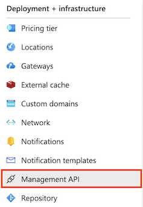

# Azure API Management REST API Authentication

This guide describes how to create the access token required to make calls into the Azure API Management REST API. 
  
For more information about authorization and other prerequisites for accessing the API Management REST API, see the [Prerequisites](../ApiManagementREST/API-Management-REST.md#Prerequisites) section of the [API Management REST](../ApiManagementREST/API-Management-REST.md).  

For more information about working with the REST API, see the [API Management .NET REST API Sample](https://github.com/Azure/api-management-samples/tree/master/restApiDemo) and the [Getting Started with Azure API Management REST API](https://azure.microsoft.com/documentation/videos/getting-started-with-azure-api-management-rest-api/) video.  

> [!IMPORTANT]
> SAS token access can be applied only for direct access API calls, for example: `https://apim-instance.management.azure-api.net/apis?api-version=2018-06-01-preview`. You cannot use it for API calls to Azure Resource Manager.
  
##  <a name="ManuallyCreateToken"></a> Manually create a SAS token  
  
1.  Navigate to your Azure API Management instance in the Azure portal.  
2.  Click **Management API** from the **API Management** section of the menu on the left. in the **API Management** section of the left navigation menu, select 

    

3. Make sure the **Enable API Management REST API** checkbox is selected.  
  
    > [!IMPORTANT]
    >  If the **Enable API Management REST API** checkbox is not checked, calls made to the REST API for that service instance will fail.  
  
     
  
4.  Specify the expiration date and time for the access token in the **Expiry** text box. This value must be in the format `MM/DD/YYYY H:MM PM|AM`.  
  
       
  
5.  Select either the primary key or secondary key in the **Secret key** drop-down list. The keys provide equivalent access; two keys are provided to enable flexible key management strategies.  
  
6.  Click **Generate** to create the access token.  
  
7.  Copy the full access token and provide it in the `Authorization` header of every request to the API Management REST API, as shown in the following example.  
  
    ```  
    Authorization: SharedAccessSignature integration&201808020500&aAsTE43MAbKMkZ6q83Z732IbzesfsaPEU404oUjQ4ZLE9iIXLz+Jj9rEctxKYw43SioCfdLaDq7dT8RQuBKc0w==
    ```  
  
##  <a name="ProgrammaticallyCreateToken"></a> Programmatically create a SAS token  
  
1.  Construct a string-to-sign in the following format: 
  
     `{identifier} + "\n" + {expiry}`  

    where:  
    `identifier` - the value of **Identifier** field from the Management API tab of your Azure API Management instance (see [previous section](#ManuallyCreateToken) for details).  
    `expiry` - desired expiry date of the SAS token.
  
2.  Generate a signature by applying an HMAC-SHA512 hash function to the string-to-sign using either the primary or secondary key.  
  
3.  Base64 encode the returned signature key.  
  
4.  Create an access token using the following format.  
  
     `uid={identifier}&ex={expiry}&sn={Base64 encoded signature}`  
  
    ```  
    uid=53dd860e1b72ff0467030003&ex=2014-08-04T22:03:00.0000000Z&sn=ItH6scUyCazNKHULKA0Yv6T+Skk4bdVmLqcPPPdWoxl2n1+rVbhKlplFrqjkoUFRr0og4wjeDz4yfThC82OjfQ==  
    ```  
  
5.  Use these values to create an `Authorization` header in every request to the API Management REST API, as shown in the following example.  
  
    ```  
    Authorization: SharedAccessSignature uid=53dd860e1b72ff0467030003&ex=2014-08-04T22:03:00.0000000Z&sn=ItH6scUyCazNKHULKA0Yv6T+Skk4bdVmLqcPPPdWoxl2n1+rVbhKlplFrqjkoUFRr0og4wjeDz4yfThC82OjfQ==
    ```  
  
 The following example demonstrates the preceding steps for generating the access token.  
  
```c#  
using System;   
using System.Text;   
using System.Globalization;   
using System.Security.Cryptography;   
  
public class Program   
{   
    public static void Main()   
    {   
        var id = "53d7e14aee681a0034030003";   
        var key = "pXeTVcmdbU9XxH6fPcPlq8Y9D9G3Cdo5Eh2nMSgKj/DWqeSFFXDdmpz5Trv+L2hQNM+nGa704Rf8Z22W9O1jdQ==";   
        var expiry = DateTime.UtcNow.AddDays(10);   
        using (var encoder = new HMACSHA512(Encoding.UTF8.GetBytes(key)))   
        {   
            var dataToSign = id + "\n" + expiry.ToString("O", CultureInfo.InvariantCulture);   
            var hash = encoder.ComputeHash(Encoding.UTF8.GetBytes(dataToSign));   
            var signature = Convert.ToBase64String(hash);   
            var encodedToken = string.Format("SharedAccessSignature uid={0}&ex={1:o}&sn={2}", id, expiry, signature);   
            Console.WriteLine(encodedToken);   
        }   
    }   
}  
  
```  

> [!NOTE]
> Both SAS token formats are correct and accepted:  
> `SharedAccessSignature uid=53dd860e1b72ff0467030003&ex=2014-08-04T22:03:00.0000000Z&sn=ItH6scUyCazNKHULKA0Yv6T+Skk4bdVmLqcPPPdWoxl2n1+rVbhKlplFrqjkoUFRr0og4wjeDz4yfThC82OjfQ==`  
> and  
> `SharedAccessSignature integration&201808020500&aAsTE43MAbKMkZ6q83Z732IbzesfsaPEU404oUjQ4ZLE9iIXLz+Jj9rEctxKYw43SioCfdLaDq7dT8RQuBKc0w==`  
  
 For complete sample code, see the [API Management .NET REST API Sample](https://github.com/Azure/api-management-samples/tree/master/restApiDemo).  
  
