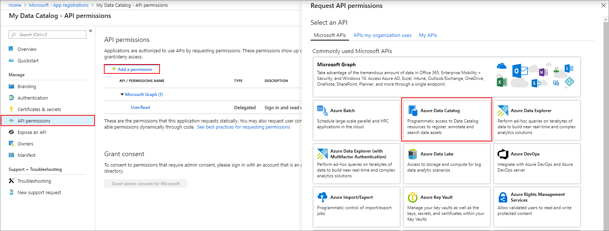

# Register a client app (Azure Data Catalog REST API)

---  
This article shows you how to register a Data Catalog client app in Azure Active Directory (Azure AD). To allow your application access to the Data Catalog REST API, you need to register your application with **Azure Active Directory**. This action allows you to establish an identity for your application and specify permissions to Data Catalog REST resources.  
  
**Important** Before you register a Data Catalog app you need an [Azure Active Directory tenant and an organizational user](Create-an-Azure-Active-Directory-tenant.md).
  
## Register a client app

Register your client app in **Azure Active Directory** to establish an identity for your application and specify permissions to **Data Catalog** REST resources. When you register a client app, such as a console app, you receive an **Application (client) ID**. The ID is used by the application to identify itself.  

1. Follow this article to Register a new client application in your company Azure Active Directory:
[Quickstart: Register an application with the Microsoft identity platform](/azure/active-directory/develop/quickstart-register-app)

   1. Open the [Azure portal](https://portal.azure.com).

   2. Select **Azure Active Directory** from the left-hand side menu.

   3. Under the **Manage** section, select **App registrations**.

   4. Select **+ New registration**.
   
   5. Enter a **name** for the application (the service principal name), such as **Azure Data Catalog account**.
   
   6. Select **Accounts in this organizational directory only** as the account type.
   
   7. For the **Redirect URI** field, enter **any URL** you want. The website doesn’t have to exist. 
   
   8. Then select **Register**. 

2. On your new app registration, select **API Permissions**. Select **+ Add a permission**.

   

3. In the list of Permissions, select **Azure Data Catalog**

4. For the choice under **What type of permissions does your application require**, select the option **Delegated permissions**.

   

5. Select the checkbox to grant permission **user_impersonation**. Then select **Add permission**.
  
## Get the Application (client) ID

You need to copy the **Application (client) ID** and **Directory (tenant) ID** values.

If you've just created the App registration, select the **Overview** page of the App registration to get ID information. 

If you've closed the App registration already, here's how to find it:

1. Open the [Azure portal](https://portal.azure.com).

2. Select **Azure Active Directory** from the list of resources.

3. Under the **Manage** heading, select **App Registrations** page. A list of **All applications**. Select the tab **Owned applications** to see only the applications you've created.

4. Select the row for the App registration you want to use.

5. Select the **Application (client) ID**. Use the copy button to copy the value, and paste into notepad or another temporary place.

6. Select the **Directory (tenant) ID**. Use the copy button to copy the value, and paste into notepad or another temporary place.

   

## Configure the Azure Data Catalog service principal

1. Browse to [http://www.azuredatacatalog.com](http://www.azuredatacatalog.com)

2. Select **Settings**. Then add the service principal to the appropriate Catalog User.

   Based on the business need, you can add it to **glossary admin** or **catalog admin**.

   > [!Note]
   > The service principal format is `<clientid>@<tenantid>`.
   > To locate the values to insert for the \<placeholders\>, use the [Azure portal](https://portal.azure.com) and open the Azure Active Directory.
   >
   > - The **Clientid** value is listed on the Azure Active Directory **App registrations (Legacy)** page in the Application ID column.
   > - The **TenantID** value is listed on the Azure Active Directory **Properties** page as the **Directory ID** property.
   >

3. Follow the [Service Principal Authentication sample](https://github.com/Azure-Samples/data-catalog-dotnet-service-principal-get-started) REST API code to build your solution.
