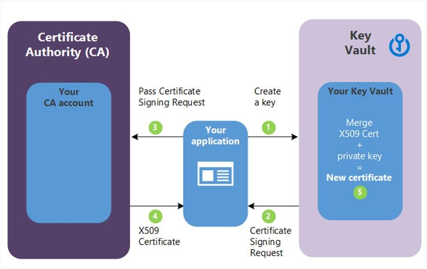

---
title: "Certificate scenarios"
ms.custom: ""
ms.date: "2016-11-11"
ms.prod: "azure"
ms.reviewer: ""
ms.service: "key-vault"
ms.suite: ""
ms.tgt_pltfrm: ""
ms.topic: "reference"
applies_to:
  - "Azure Key Vault"
ms.assetid: a788b958-3acb-4bb6-9c94-4776852aeea1
caps.latest.revision: 16
author: "bruceperlerMS"
ms.author: "bruceper"
manager: "mbaldwin"
---
# Get started with certificates
The following scenarios outline several of the primary usages of Key Vault’s certificate management service including the additional steps required for creating your first certificate in your key vault.

The following are outlined:
- Creating your first Key Vault certificate
- Creating a certificate with a Certificate Authority that is partnered with Key Vault
- Creating a certificate with a Certificate Authority that is not partnered with Key Vault
- Import a certificate

## Certificates are complex objects
Certificates are composed of three interrelated resources linked together as a Key Vault certificate; certificate metadata, a key and a secret.

## Creating your first Key Vault certificate  
 Before a certificate can be created in a Key Vault (KV), prerequisite steps 1 and 2 must be successfully accomplished and, a key vault must exist for this user / organization.  

Step 1.  Certificate Authority (CA) Providers  

-   On-boarding as the IT Admin, PKI Admin or anyone managing accounts with CAs,for a given company (ex. Contoso)  is a prerequisite to using KV certificates.  

    The following CAs are the current supported/partnered providers with Key Vault:  

    -   DigiCert - Key Vault offers OV SSL certificates with DigiCert.  

    -   GlobalSign - Key Vault offers OV SSL certificates with GlobalSign  

    -   WoSign - Key Vault offers OV SSL or EV SSL certificates with WoSign based on setting configured by customer in his/her WoSign account on WoSign portal.  

Step 2.  An account admin for a CA Provider creates credentials  to be used by Key Vault to enroll and renew and use SSL certificates via Key Vault  

Step 3.  A Contoso admin along with a Contoso employee (Key Vault user) who owns certificates, depending on the CA, can get a certificate from the admin or directly from his account with the CA.  

-   Begin an add credential operation to a key vault by creating a Key Vault issuer object/resource.  

      In PowerShell this is accomplished by the Add-KeyVaultCertificateIssuer cmdlet.  

    -   Ex. MyDigiCertIssuer  

        -   Provider  

        -   Credentials – CA account creds. Each CA has its own specific data.  

     For more information on creating accounts with CA Providers, see the related post on the [Key Vault blog](http://aka.ms/kvcertsblog).  

Step 3.1 - set up contacts for notifications (in PowerShell this is accomplished by the Add-KeyVaultCertificateContacts cmdlet) this is the contact for Key Vault user. Key Vault does not enforce this step.  

Note - This process, through step 3.1, is a onetime operation.  

## Creating a certificate with a Certificate Authority that is partnered with Key Vault

Step 4.
The following step descriptions correspond to the green numbered steps in the preceding diagram.  

  (1) - In the diagram above, your application is creating a certificate which internally begins by creating a key in your key vault.  

  (2) - Key Vault sends and SSL Certificate Request to the CA.  

  (3) - Your application polls, in a loop and wait process, for  your  Key Vault for certificate completion. The certificate creation is complete when Key Vault receives the CA’s response with x509 certificate.  

  (4) - The CA responds to Key Vault's SSL Certificate Request with an X509 SSL Certificate.  

  (5) - Your new certificate creation completes with the merger of the X509 Certificate for the CA.  

  Key Vault user – creates a certificate by specifying a policy  (in PowerShell this is accomplished by the Add-KeyVaultCertifcate (name, certificate name, )  cmdlet)  

  -   Repeat as needed  

  -   Policy constraints  

      -   X509 properties  

      -   Key properties  

      -   Provider reference - > ex. MyDigiCertIssure  

      -   Renewal information - > ex. 90 days before expiry  

  -   A certificate creation process is usually an asynchronous process and involves polling your key vault for the state of the create certificate operation.  

      -   Get-AzureKeyVaultOperation  

            -   Status: completed, failed w/ error info, Canceled  

            -   Because of the delay to create, a cancel operation can be initiated. The cancel may or may not be effective.  

## Import a certificate  
 Alternatively – a cert can be imported into Key Vault – PFX or PEM.  

 For more information on PEM format, see the certificates section of [About keys, secrets, and certificates](about-keys--secrets-and-certificates.md).  

 Import certificate – requires a PEM or PFX to be on disk and have a private key. In PowerShell this is the Import-KeyValutCertifcate cmdlet

-   You must specify : vault name, cert name, policy is optional,  

-   PEM / PFX files contains attributes that KV can parse and use to populate the certificate policy. If a certificate policy is already specified, KV will try to match data from PFX  / PEM file.  

-   Once the import is final, subsequent operations will use the new policy (new versions).  

-   If ther are no further operations, the first thing KV will do is send an expiration notice  

-   Also, the user can edit the policy which is functional at the time of import but, will contain defaults where no information was specified at import. Ex. no issuer info  

## Creating a certificate with a Certificate Authority that is not partnered with Key Vault  
 Allows working with other Certificate Authorities (CA) than Key Vault's partnered providers. This means your organization can work with a CA of its choice.  

  

 The following step descriptions correspond to the green lettered steps in the preceding diagram.  

  Step 1 - In the diagram above, your application is creating a certificate which internally begins by creating a key in your key vault.  

  Step 2 - Key Vault returns to your application  a Certificate Signing Request (CSR)  

  Step 3 - Your application passes the CSR to your chosen CA.  

  Step 4 - Your chosen CA responds with a an X509 Certificate.  

  Step 5 - Your application completes the new certificate creation with a merger of the X509 Certificate from your CA.

## See Also
- [Certificate operations](certificate-operations.md)
- [About keys, secrets, and certificates](about-keys--secrets-and-certificates.md)
