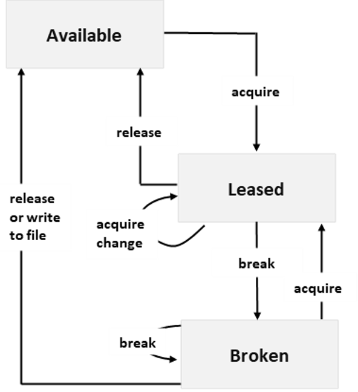

# Lease File

The `Lease File` operation creates and manages a lock on a file for write and delete operations. `Lease File` is supported for versions 2019-02-02 and newer.
  
 The `Lease File` operation can be called in one of four modes:  
  
- `Acquire`, to request a new lease.  

- `Change`, to change the ID of an existing lease.  
  
- `Release`, to free the lease if it is no longer needed so that another client may immediately acquire a lease against the file.  
  
- `Break`, to forcibly end the lease but ensure that another client cannot acquire a new lease until the current lease period has expired.  
  
## Request  
 The `Lease File` request may be constructed as follows. HTTPS is recommended. Replace *myaccount* with the name of your storage account:  
  
||PUT Method Request URI|HTTP Version|  
|-|----------------------------|------------------|  
||`https://myaccount.file.core.windows.net/myshare/mydirectory/myfile?comp=lease`|HTTP/1.1|  

 Replace the path components shown in the request URI with your own, as follows:  
  
|Path Component|Description|  
|--------------------|-----------------|  
|*myaccount*|The name of your storage account.|  
|*myshare*|The name of your file share.|  
|*mydirectorypath*|Optional. The path to the directory.|  
|*myfile*|The name of the file.|  
  
### URI Parameters  
 The following additional parameters may be specified on the request URI.  
  
|Parameter|Description|  
|---------------|-----------------|  
|`timeout`|Optional. The `timeout` parameter is expressed in seconds. For more information, see [Setting Timeouts for File Service Operations](Setting-Timeouts-for-File-Service-Operations.md).|  
  
### Request Headers  
 The following table describes required and optional request headers.  
  
|Request Header|Description|  
|--------------------|-----------------|  
|`Authorization`|Required. Specifies the authorization scheme, account name, and signature. For more information, see [Authorize requests to Azure Storage](authorize-requests-to-azure-storage.md).|  
|`Date` or `x-ms-date`|Required. Specifies the Coordinated Universal Time (UTC) for the request. For more information, see [Authorize requests to Azure Storage](authorize-requests-to-azure-storage.md).|  
|`x-ms-version`|Optional. Specifies the version of the operation to use for this request. For more information, see [Versioning for the Azure Storage Services](Versioning-for-the-Azure-Storage-Services.md).|  
|`x-ms-lease-id: <ID>`|Required to renew, change, or release the lease.<br /><br /> The value of x-ms-lease-id can be specified in any valid GUID string format. See [Guid Constructor (String)](https://msdn.microsoft.com/library/96ff78dc.aspx) for a list of valid GUID string formats.|  
|`x-ms-lease-action: <acquire ¦ change ¦ release ¦ break>`|`acquire`: Requests a new lease. If the file does not have an active lease, the File service creates a lease on the file and returns a new lease ID.  If the file has an active lease, you can only request a new lease using the active lease ID.<br /><br /> `change`: Changes the lease ID of an active lease. A `change` must include the current lease ID in x-ms-lease-id and a new lease ID in x-ms-proposed-lease-id.<br /><br /> `release`: Releases the lease. The lease may be released if the lease ID specified on the request matches that associated with the file. Releasing the lease allows another client to immediately acquire the lease for the file as soon as the release is complete.<br /><br /> `break`: Breaks the lease, if the file has an active lease. Any authorized request can break the lease; the request is not required to specify a matching lease ID. An infinite lease is broken immediately.
|`x-ms-lease-duration: -1 `|Only allowed and required on an `acquire` operation. Required to be -1 to indicate a lease that never expires.|  
|`x-ms-proposed-lease-id: <ID>`|Optional for `acquire`, required for `change`. Proposed lease ID, in a GUID string format. The File service returns `400 (Invalid request)` if the proposed lease ID is not in the correct format. See [Guid Constructor (String)](https://msdn.microsoft.com/library/96ff78dc.aspx) for a list of valid GUID string formats.|  
|`x-ms-client-request-id`|Optional. Provides a client-generated, opaque value with a 1 KB character limit that is recorded in the analytics logs when storage analytics logging is enabled. Using this header is highly recommended for correlating client-side activities with requests received by the server. For more information, see [About Storage Analytics Logging](About-Storage-Analytics-Logging.md) and [Azure Logging: Using Logs to Track Storage Requests](https://blogs.msdn.com/b/windowsazurestorage/archive/2011/08/03/windows-azure-storage-logging-using-logs-to-track-storage-requests.aspx).|  
  
### Request Body  
 None.  
  
### Sample Request  
 The following sample request shows how to acquire a lease:  
  
```  
  
Request Syntax:  
PUT https://myaccount.file.core.windows.net/myshare/mydirectory/myfile?comp=lease HTTP/1.1  
  
Request Headers:  
x-ms-version: 2019-07-07  
x-ms-lease-action: acquire  
x-ms-lease-duration: -1  
x-ms-proposed-lease-id: 1f812371-a41d-49e6-b123-f4b542e851c5  
x-ms-date: <date>  
Authorization: SharedKey testaccount1:esSKMOYdK4o+nGTuTyeOLBI+xqnqi6aBmiW4XI699+o=  
  
```  
  
## Response  
 The response includes an HTTP status code and a set of response headers.  
  
### Status Code  
 The success status codes returned for lease operations are the following:  
  
- `Acquire`: A successful operation returns status code 201 (Created).  
  
- `Change`: A successful operation returns status code 200 (OK).  
  
- `Release`: A successful operation returns status code 200 (OK).  
  
- `Break`: A successful operation returns status code 202 (Accepted).  
  
 For information about status codes, see [Status and Error Codes](Status-and-Error-Codes2.md).  
  
### Response Headers  
 The response for this operation includes the following headers. The response may also include additional standard HTTP headers. All standard headers conform to the [HTTP/1.1 protocol specification](https://go.microsoft.com/fwlink/?linkid=150478).  
  
|Syntax|Description|  
|------------|-----------------|  
|`ETag`|The `ETag` header contains a value that you can use to perform operations conditionally, in quotes. The `Lease File` operation does not modify this property.|  
|`Last-Modified`|The date/time that the file was last modified. The date format follows RFC 1123. For more information, see [Representation of Date-Time Values in Headers](Representation-of-Date-Time-Values-in-Headers.md).<br /><br /> Any write operation on the file, including updates on the file's metadata or properties, changes the last-modified time of the file. The `Lease File` operation does not modify this property.|  
|`x-ms-lease-id: <id>`|When you request a lease, the File service returns a unique lease ID. While the lease is active, you must include the lease ID with any request to write to the file, or to change, or release the lease.<br /><br /> A successful renew operation also returns the lease ID for the active lease.|  
|`x-ms-lease-time: seconds`|This header is returned only for a successful request to break the lease. 0 is returned for immediate breaks.|  
|`x-ms-request-id`|This header uniquely identifies the request that was made and can be used for troubleshooting the request. For more information, see [Troubleshooting API Operations](Troubleshooting-API-Operations.md).|  
|`x-ms-version`|Indicates the version of the File service used to execute the request.|  
|`Date`|A UTC date/time value generated by the service that indicates the time at which the response was initiated.|  
|`x-ms-client-request-id`|This header can be used to troubleshoot requests and corresponding responses. The value of this header is equal to the value of the `x-ms-client-request-id` header if it is present in the request and the value is at most 1024 visible ASCII characters. If the `x-ms-client-request-id` header is not present in the request, this header will not be present in the response.|  
  
### Response Body  
 None.  
  
### Sample Response  
 The following is a sample response for a request to acquire a lease:  
  
```  
Response Status:  
HTTP/1.1 201 Created  
  
Response Headers:  
Server: Windows-Azure-File/1.0 Microsoft-HTTPAPI/2.0  
x-ms-request-id: cc6b209a-b593-4be1-a38a-dde7c106f402  
x-ms-version: 2019-07-07
x-ms-lease-id: 1f812371-a41d-49e6-b123-f4b542e851c5  
Date: <date>  
  
```  
  
## Authorization  
 This operation can be called by the account owner and by any client with a shared access signature that has permission to write to this file or its share.  
  
## Remarks  
 A lease on a file provides exclusive write and delete access to the file. To write to a file with an active lease, a client must include the active lease ID with the write request. The lease is granted for an infinite duration.  
  
 When a client acquires a lease, a lease ID is returned. The File service will generate a lease ID if one is not specified in the acquire request. The client may use this lease ID to change its lease ID or release the lease.  
  
 When a lease is active, the lease ID must be included in the request for any of the following operations:  
  
- [Create File](Create-File.md)  
  
- [Set File Metadata](Set-File-Metadata.md)  
  
- [Set File Properties](Set-File-Properties.md)  
  
- [Delete File](Delete-File2.md)  
  
- [Put Range](Put-Range.md)  
  
- [Copy File](Copy-File.md) (lease ID needed for destination file)  
  
 If the lease ID is not included, these operations will fail on a leased file with `412 – Precondition failed`.  
  
 The following operations succeed on a leased file without including the lease ID:  
  
- [Get File](Get-File.md)  
  
- [Get File Metadata](Get-File-Metadata.md)  
  
- [Get File Properties](Get-File-Properties.md)  
  
- [List Ranges](List-Ranges.md)  
  
- [List Directories and Files](List-Directories-and-Files.md)  
  
- [Copy File](Copy-File.md) (No lease ID needed for source file.)  
  
- [Lease File (REST API)](Lease-File.md) (No lease ID needed for `x-ms-lease-action: break`.)  
  
 It's not necessary to include the lease ID for GET operations on a file that has an active lease. However, all GET operations support a conditional lease parameter, where the operation only proceeds if the lease ID included with the request is valid.  
  
 All share operations are permitted on a share that includes files with an active lease, including [Delete Share](Delete-Share.md). Therefore a share may be deleted even if files within it have active leases.
  
 The following diagram shows the three states of a lease, and the commands or events that cause lease state changes.  
  
   
  
 **Lease States**  
  
 A lease can be in 3 states, based on whether the lease is locked or unlocked, and whether the lease is renewable in that state. The lease actions above cause state transitions.  
  
- `Available`, the lease is unlocked and can be acquired. Allowed action: `acquire`.  
  
- `Leased`, the lease is locked. Allowed actions: `acquire` (same lease ID only), `change`, `release`, and `break`.  
  
- `Broken`, lease has been broken. Allowed actions: `acquire`, `release`, and `break`.  
  
 Note that a lease cannot be granted for a file in a share snapshot, since snapshots are read-only. Requesting a lease against a file in a share snapshot results in status code 400 (Bad Request).  
  
 The file's `Last-Modified-Time` property is not updated by calls to `Lease File`.  
  
 The following tables show outcomes of actions on files with leases in various lease states. Letters (A), (B), and (C) represent lease IDs, and (X) represents a lease ID generated by the File service.  
  
### Outcomes of use attempts on files by lease state  
  
||Available|Leased (A)|Broken (A)|
|-|---------------|------------------|--------------------|------------------|-------------------|  
|Write using (A)|Fails (412)|Leased (A), write succeeds|Fails (412)|  
|Write using (B)|Fails (412)|Fails (409)|Fails (412)|  
|Write, no lease specified|Available, write succeeds|Fails (412)|Available, write succeeds|  
|Read using (A)|Fails (412)|Leased (A), read succeeds|Fails (412)|  
|Read using (B)|Fails (412)|Fails (409)|Fails (412)|  
|Read, no lease specified|Available, read succeeds|Leased (A), read succeeds|Broken (A), read succeeds|  
  
### Outcomes of lease operations on files by lease state  
  
||Available|Leased (A)|Broken (A)|  
|-|---------------|------------------|--------------------|------------------|-------------------|  
|`Acquire`, no proposed lease ID|Leased (X)|Fails (409)|Leased (X)|  
|`Acquire` (A)|Leased (A)|Leased (A)|Leased (A)|  
|`Acquire` (B)|Leased (B)|Fails (409)|Leased (B)|  
|`Break`|Fails (409)|Broken (A)|Broken (A)|  
|`Change`, (A) to (B)|Fails (409)|Leased (B)|Fails (409)|  
|`Change`, (B) to (A)|Fails (409)|Leased (A)|Fails (409)|  
|`Change`, (B) to (C)|Fails (409)|Fails (409)|Fails (409)|  
|`Release` (A)|Fails (409)|Available|Available|  
|`Release` (B)|Fails (409)|Fails (409)|Fails (409)|  
  
## See also
  
 [Authorize requests to Azure Storage](authorize-requests-to-azure-storage.md)   
 [Status and Error Codes](Status-and-Error-Codes2.md)   
 [File Service Error Codes](File-Service-Error-Codes.md)   
